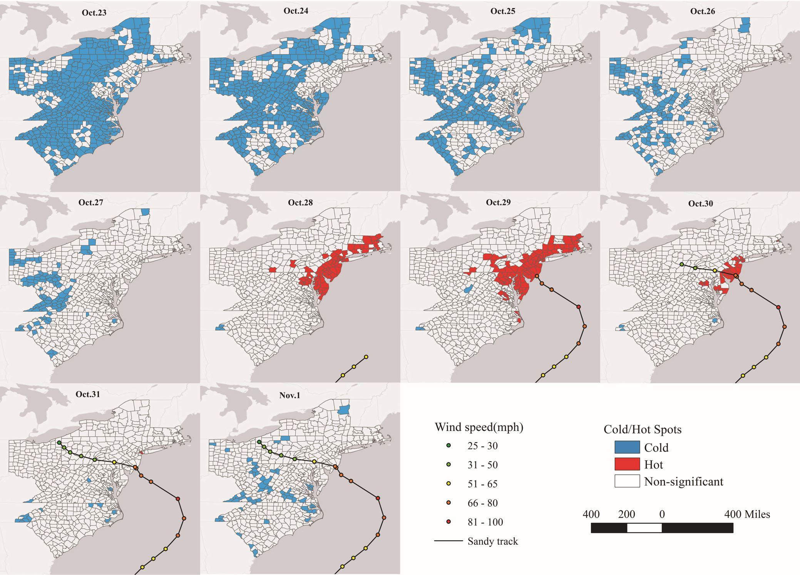
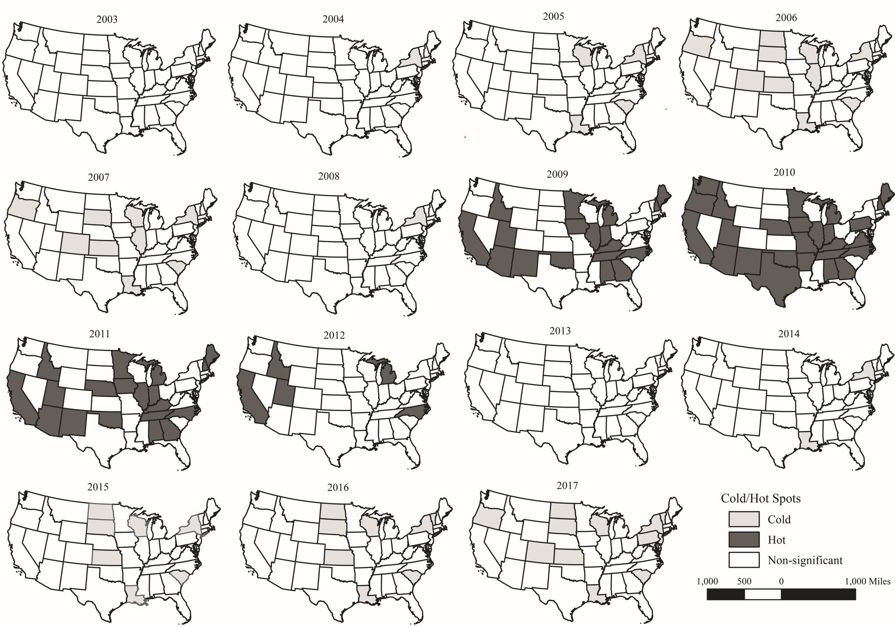

## This repository contains Data and Code for the paper published in The professional Geographer 
The peper is titled "Extending Getis–Ord Statistics to Account for Local
Space–Time Autocorrelation in Spatial Panel Data". In this paper, I developed a new method which can be used to summarize space–time patterns from spatial panel data, identify changes of landscape more consistently, and lend the results readily to visualization.

## The new method extends the Getis–Ord $G_{i}$ and $G_{i}^{*}$ statistics to the space-time domain
1. ### Space–time contemporaneous weight matrix
   
   Space–time contemporaneous specification indicates that “a location i links to its preceding in situ location as well as the instantaneous neighboring locations”.

2. ### Space–time lagged weight matrix 
    
    Space–time lagged specification is that “a location i links to its preceding in situ location as well as the preceding neighboring locations”.
    

3. ### Space-time $G_{i}$ and $G_{i}^{*}$
    
    Modified from its spatial counterpart, the null hypothesis of space–time $G_{i}$ can be specified as follows: The sum of observations at $i$’s ($i=1, 2, …,N$) space–time neighbors (excluding $i$) is not more extreme (either larger or smaller) than one would expect by chance given all of the observation(excluding $i$).

    $G_{i}(V_{ST}) = \frac{\sum_{j,j≠i} v_{ij}x_j}{\sum_{j,j≠i}x_j}$

    
    Likewise, the null hypothesis of space–time $G_{i}$ can be stated as follows: The sum of observations at $i$’s ($i=1, 2, …,N$) space–time neighbors (including $i$) is not more extreme (either larger or smaller) than one would expect by chance given all of the observations (including $i$).

    $G_{i}^*(V_{ST}) = \frac{\sum_{j} v_{ij}x_j}{\sum_{j}x_j}$

## Two applications

